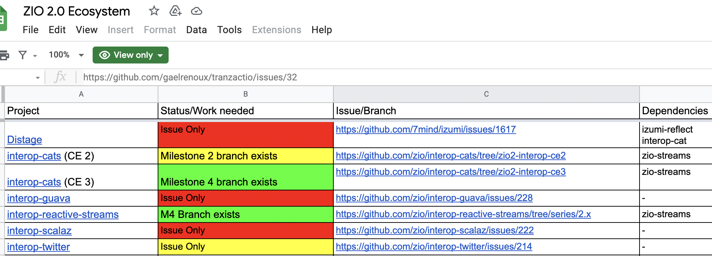
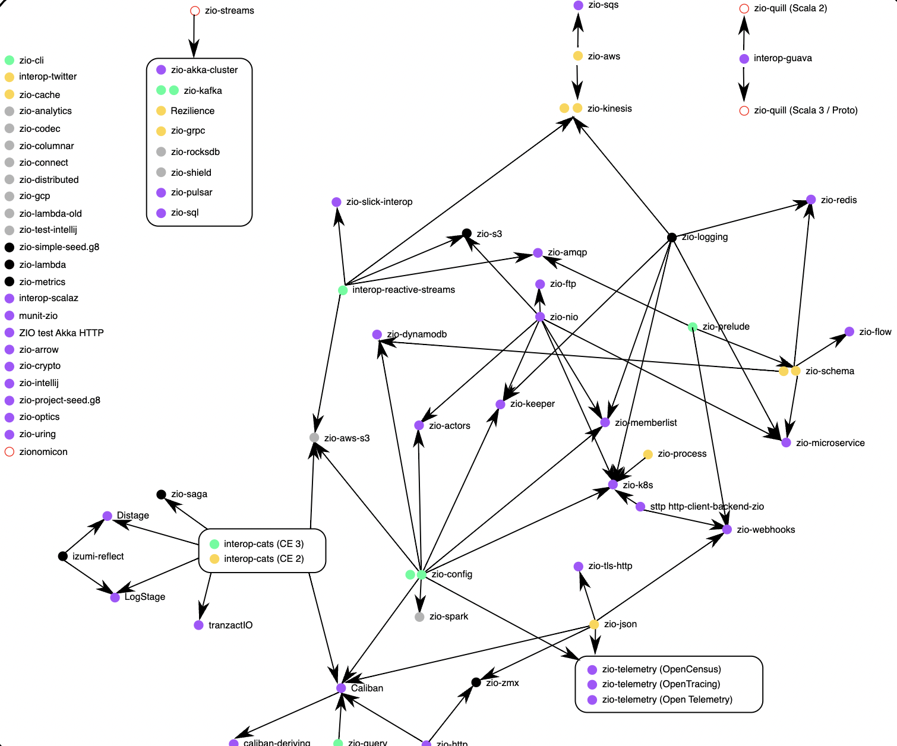
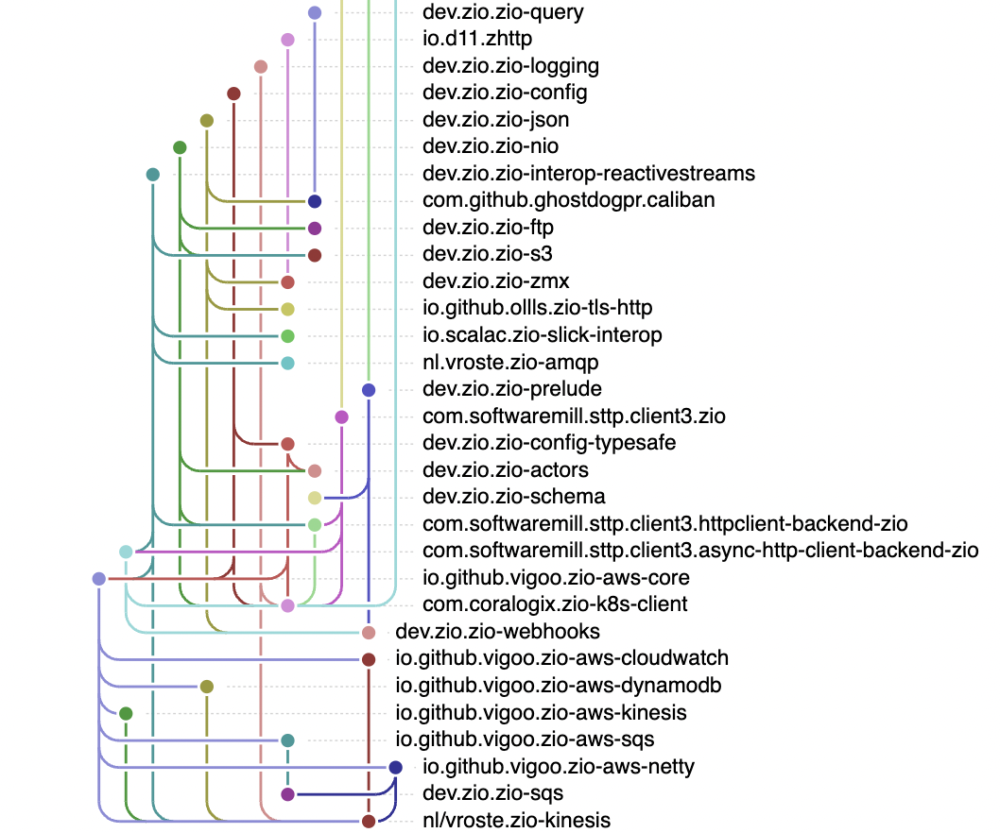
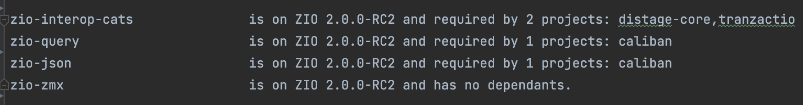

# ZIO Ecosystem 

---

# [zio-ecosystem.herokuapp.com](https://zio-ecosystem.herokuapp.com)

  

    

    Bill Frasure
    

    

      <a href="https://github.com/swoogles">
        github.com/swoogles
      </a>
    

  

  

    
  

---

# Situation

ZIO 1 is out and heavily used by the community

Joined Ziverge

ZIO 2.0 approaches!

We need the community to build on it!

---

# Questions

"Who is publishing for 2.x releases?"

"Who is working towards a release?"

"Can we track this?"

---
# Constructing an elegant Alpha

---
# Excel-lent

---
# Excel Downsides
- Tables only take you so far
- Manually-entered data is stale immediately

---

# Win - Got a colleague interested

---
# Fun Graphs

Credit - Will Harvey

---
# Fun Graphs

Credit - Will Harvey

---
# Graph Downsides 

- Output requires hand-tuning
- Still hectic

---

# Win - We highlighted connections

---

# Next up, automation

---
# Core Logic
- Find the latest release of project on Maven
- Extract dependencies from POM file
- Slam everything into a graph

---
###  Terminal Velocity

Built with ZIO-cli

---
### Terminal Downsides

- You have to view in a terminal
- Built 3 views before I got annoyed
- Useful, but not _easy_

---
# To the Web!

---

# * DEMO *

---

# Cool, but I need to be at the computer

---

# * DEMO *

---

# How did we find the relevant PRs?

---

# Advanced Deep-learning Algorithm

---

<pre>

pullRequests  
  .find(pr =>  
    pr.title.contains("zio") && pr.title.contains("2"))  
</pre>

---
# Potential Features

https://github.com/swoogles/zio-ecosystem/issues

---
# Thanks

Will Harvey, for the inspiring graphs and spurring me to take this beyond a spreadsheet

Adam Fraser, for guidance and non-guidance

Ziverge, for attracting enthusiastic engineers and letting them build

---

# [zio-ecosystem.herokuapp.com](https://zio-ecosystem.herokuapp.com)

  

    

    Bill Frasure
    

    

      <a href="https://github.com/swoogles">
        github.com/swoogles
      </a>
    

  

  

    
  

---

