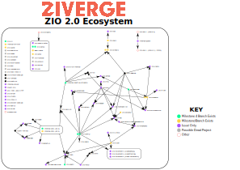

Talk @ 9:55 AM
# Problem

ZIO 2.0 approaches!
Build libraries on RCs, please!

---
# How It Started

- "We want to find out where everyone is at"

---
### How It Started

---
# Front-end agnostic logic
- Find the latest release of project on Maven
- Examine POM file to determine: 
  - Version of ZIO it depends on
  - ZIO project dependencies
  - ZIO projects that are dependent on it
  - Use ScalaGraph to achieve that
    - Show rendered graph example?

---
# CLI Phase

- Used ZIO-cli
  - *TODO DEMO* 1 cool feature/API decision
- Output just goes to terminal
  - Useful for me, but not for thee
- Constructed 3 different views of the data before I got annoyed

--- 

---
### Terminally Demanding

---
# Current Web Phase

- ZHTTP
- *TODO DEMO* "advanced" open-PR query code
- 
---

<pre>
pullRequests  
  .find(pr =>  
    pr.title.contains("zio") && pr.title.contains("2"))  
</pre>

---
# Limitations
- *Only* checks projects against the latest version of ZIO
- List of tracked projects is hard-coded in src code

---
# Potential Future Features
TODO Turn these into Github issues before talk
- Show all transitive dependencies/dependents
- Checkboxes to construct multi-library SBT snippet
- More information on each project card
- Incorporate drawn graphs
